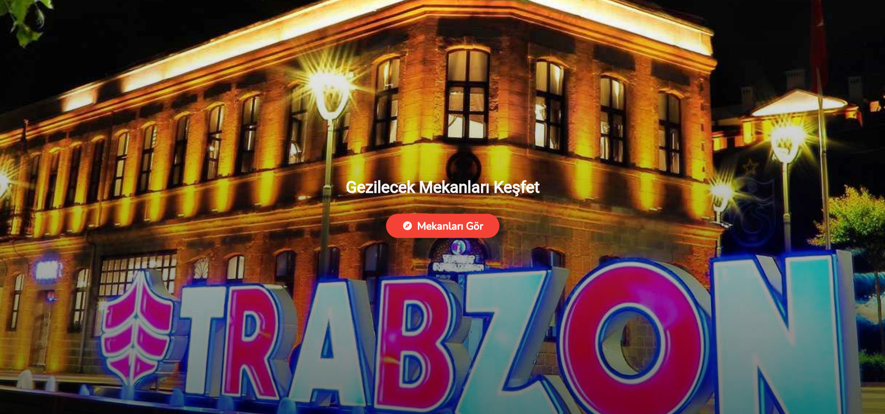
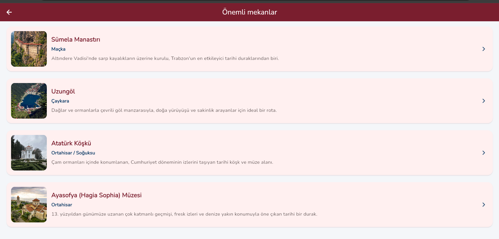
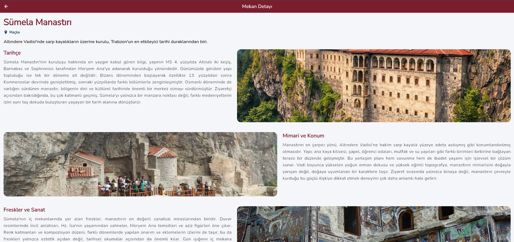

# TRABZON ŞEHİR REHBERİ UYGULAMASI

## Kapak

- **Ders:** İleri Programlama
- **Ödev Konusu:** Kişiselleştirilmiş Bilgi ve Keşif Uygulaması
- **Proje Adı:** Trabzon Şehir Rehberi
- **Hazırlayan:** İnanç Kara
- **Öğrenci No:** 243302011
- **Teslim Tarihi:** 19.04.2026
- **GitHub Linki:** [repo linkini buraya ekle]

---

## 1) Proje Amacı ve Fikri

Bu projede Trabzon’daki gezilecek yerleri tek bir uygulamada toplamak istedim. Kullanıcı ana sayfadan giriş yapıp mekan listesine geçiyor, oradan da seçtiği yerin detayını açabiliyor.

Bu konuyu seçmemin nedeni, hem şehir rehberi fikrinin bana yakın gelmesi hem de Flutter tarafında navigation, listeleme ve detay ekranı mantığını gerçek bir örnek üzerinde oturtmak istememdi.

---

## 2) Projenin Temel Klasör Yapısı

```text
flutter_application_1/
  lib/
    main.dart
    ana_sayfa.dart
    liste_sayfasi.dart
    detay_sayfasi.dart
  assets/
    trabzon_anasayfa.jpg
    sumela_1.jpg, sumela_2.jpg, sumela_3.jpg
    uzungol_1.jpg, uzungol 2.jpg, uzungol_3.jpg
    ayasofya 1.jpg, ayasofya 2.jpg, ayasofya 3.jpg
    ataturk 1.jpg, ataturk 2.jpg, ataturk 3.jpg
  pubspec.yaml
```

- `lib` klasöründe dart dosyaları bulunuyor.
- `assets` klasöründe uygulamada gösterdiğim tüm görseller var.
- `pubspec.yaml` içinde `assets/` tanımı olduğu için resimler ekranda düzgün açılıyor.

---

## 3) Teknik Gereksinimlere Uygunluk

### 3.1 Çoklu Sayfa Yapısı

Projede en az 3 ekran şartı sağlanmıştır:

1. `ana_sayfa.dart`
2. `liste_sayfasi.dart`
3. `detay_sayfasi.dart`

### 3.2 Navigasyon

- `Navigator.push` ile sayfalar arası geçiş yaptım.
- `Navigator.pop` ile geri dönüş akışını kullandım.

### 3.3 Zorunlu Widget Kullanımı

Projede istenen tüm temel widget’lar vardır:

- `Scaffold`
- `AppBar`
- `Container`
- `Column`
- `Row`
- `Image`
- `Text`
- `ListView`

### 3.4 Özgün UI

Ana sayfada full-screen görsel, gradient ve hover/parallax efekti kullandım. Liste ekranında card yapısı ile düzenli bir görünüm verdim. Detay ekranında da metin, görsel ve “yol tarifi al” butonunu bir arada kullanarak daha işlevli bir yapı kurdum.

---

## 4) Kod Blokları ve Teknik Açıklamalar

### 4.1 `main.dart`

```dart
void main() {
  runApp(const TrabzonRehberiApp());
}

class TrabzonRehberiApp extends StatelessWidget {
  const TrabzonRehberiApp({super.key});

  @override
  Widget build(BuildContext context) {
    const bordo = Color(0xFF7A1E2E);
    const lacivert = Color(0xFF0D3B66);

    return MaterialApp(
      title: 'Trabzon Şehir Rehberi',
      debugShowCheckedModeBanner: false,
      theme: ThemeData(
        colorScheme: ColorScheme.fromSeed(
          seedColor: bordo,
          primary: bordo,
          secondary: lacivert,
        ),
      ),
      home: const AnaSayfa(),
    );
  }
}
```

Uygulamanın başlangıç kısmı burada. Tema renklerini tek noktadan ayarladığım için ekranlar arasında renk tutarlılığı korundu ve kod tekrarı azaldı.

---

### 4.2 `ana_sayfa.dart`

```dart
MouseRegion(
  onHover: (event) {
    final yatayOran = ((event.position.dx / ekranBoyutu.width) * 2 - 1)
        .clamp(-1.0, 1.0)
        .toDouble();
    final dikeyOran = ((event.position.dy / ekranBoyutu.height) * 2 - 1)
        .clamp(-1.0, 1.0)
        .toDouble();

    setState(() {
      _yatayKaymaCarpani = yatayOran;
      _dikeyKaymaCarpani = dikeyOran;
    });
  },
)
```

Bu ekranda sadece sabit bir fotoğraf yerine mouse hareketine tepki veren bir giriş tasarımı kurdum. İlk denemede dikey hareket sırasında üst/alt kısımda beyaz boşluk çıkıyordu; `OverflowBox` ile arka planı biraz taşırarak bu sorunu çözdüm.

---

### 4.3 `liste_sayfasi.dart`

```dart
ListView.separated(
  itemCount: _mekanlar.length,
  separatorBuilder: (context, index) => const SizedBox(height: 14),
  itemBuilder: (context, index) {
    final mekan = _mekanlar[index];
    return Card(
      child: InkWell(
        onTap: () {
          Navigator.push(
            context,
            MaterialPageRoute<void>(
              builder: (context) => DetaySayfasi(
                baslik: mekan.baslik,
                bolge: mekan.bolge,
                kisaAciklama: mekan.kisaAciklama,
                detayMetni: mekan.detayMetni,
                resimAssetYolu: mekan.resimAssetYolu,
              ),
            ),
          );
        },
      ),
    );
  },
)
```

Mekanları card düzeninde göstermek için `ListView.separated` kullandım. Bu yapı sayesinde hem içerik dinamik kaldı hem de kartlar arası boşluk kontrolü temiz bir şekilde yapıldı.

---

### 4.4 `detay_sayfasi.dart`

```dart
Uri get _haritaUri {
  final sorgu = Uri.encodeComponent('$baslik $bolge Trabzon');
  return Uri.parse('https://www.google.com/maps/search/?api=1&query=$sorgu');
}

Future<void> _yolTarifiAc(BuildContext context) async {
  final basarili = await launchUrl(
    _haritaUri,
    mode: LaunchMode.externalApplication,
  );

  if (!basarili && context.mounted) {
    ScaffoldMessenger.of(context).showSnackBar(
      const SnackBar(content: Text('Harita bağlantısı açılamadı.')),
    );
  }
}
```

Burada önce seçilen mekanın adı ve bölgesini birleştirip Google Maps arama linki ürettim (`_haritaUri`). Sonra `launchUrl` ile bu linki telefonun/bilgisayarın dış harita uygulamasında açtım. Yani kullanıcı butona bastığında o mekanın konumu direkt arama sonucuyla geliyor. Eğer link açılmazsa da ekranda `SnackBar` ile hata mesajı gösterdim.

---

## 5) Bu Projede Öğrendiklerim

- Çoklu sayfa mimarisi kurma
- `Navigator.push` / `Navigator.pop` akışı
- Ekranlar arası veri taşıma
- Asset yönetimi
- Basit UI animation kullanımı (hover, parallax)

En çok geliştirdiğim kısım, liste ekranından seçilen veriyi detay ekranına doğru ve düzenli şekilde aktarmak oldu.

---

## 6) Süreçte Karşılaştığım Durumlar

- Bir aşamada `const` kaynaklı compile hatası aldım. Kodda kalan eski bloğu temizleyip tekrar çalıştırınca düzeldi.
- Parallax efekti eklerken dikey harekette beyaz boşluk oluştu. Arka plan görselini daha büyük çizdirerek çözdüm.


---

## 7) Ekran Görüntüleri

### Ana Sayfa

Ana sayfada giriş tasarımı, arka plan görseli ve “Mekanları Gör” butonu yer alıyor.



### Liste Sayfası

Bu ekranda mekanlar kart yapısında listeleniyor ve seçilen kart detay sayfasına gidiyor.



### Detay Sayfası

Detay ekranında seçilen mekana ait bilgi, görseller ve yol tarifi butonu gösteriliyor.



---

## 8) Sonuç

Bu ödevde istenen teknik gereksinimleri karşılayan ve kullanım açısından düzenli bir şehir rehberi uygulaması geliştirdim. Uygulamanın temel akışını (ana sayfa -> liste -> detay) stabil şekilde kurdum ve görsel açıdan da okunabilir, sade ama dikkat çekici bir arayüz oluşturdum.

---

## 9) Teslim Öncesi Kontrol Listesi

- [ ] GitHub linki eklendi
- [x] Öğrenci no eklendi
- [x] Ekran görüntüleri eklendi
- [ ] Rapor PDF’e çevrildi
- [ ] Dosya adı `inanc_kara.pdf` yapıldı
- [ ] DBS yüklemeye hazır
